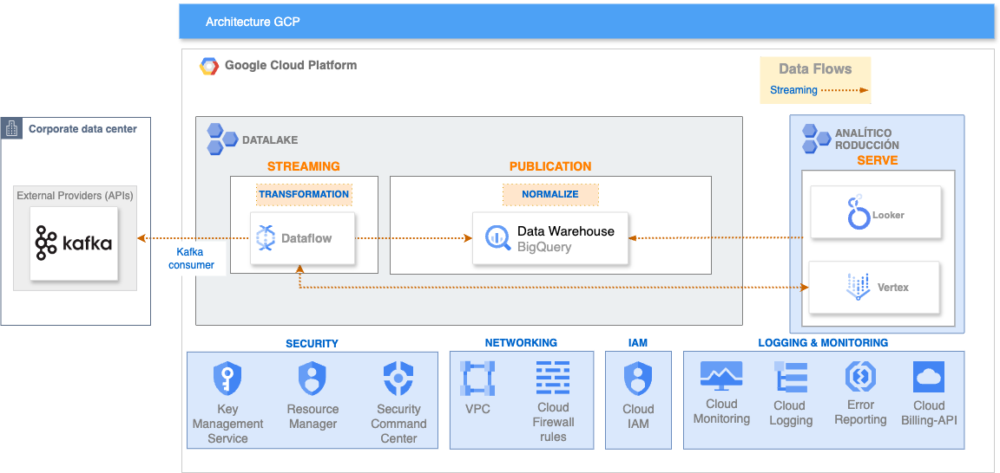

# Dataflow Connector: Kafka to Bigquery

## Overview

This project provides a dataflow job to seamlessly transfer data from Apache Kafka to Bigquery. The connector is designed to simplify the integration between Kafka and Bigquery, enabling smooth data flow and communication between these two systems.




## Features

- **Data Reliability**: Ensure reliable data transfer from Kafka to Bigquery with built-in error handling and fault tolerance.
- **Configurability**: Easily configure the connector to adapt to different Kafka and Bigquery setups, making it highly customizable for different environments.
- **Scalability**: Scale the connector horizontally to handle high data throughput and meet the demands of growing systems.

## Prerequisites

- [Docker engine](https://docs.docker.com/engine/install/)
- [Docker compose](https://docs.docker.com/compose/install/)
- [Google cloud sdk](https://cloud.google.com/sdk/docs/install?hl=es-419)
- [Terraform 1.2.9](https://releases.hashicorp.com/terraform/1.2.9/) and the complete [Guide](https://developer.hashicorp.com/terraform/install)

## Installation

```
├──kafka-consumer
├──kafka-producer
├──infra
   ├── .auto.tfvars
   │── main.tf
   |── version.tf
```

First of all create the necessary infrastructure:

```bash
  gcloud init
  export GOOGLE_APPLICATION_CREDENTIALS="/path/key.json"
  cd infra
  terraform init
  terraform apply
```

## Environment Setup Kafka

Once the infrastructure is deployed, deploy kafka on your local environment:

```bash
  cd ..
  docker-compose up -d
```

For this we will use the docker-compose.yml file deployed in the main folder. This contains the configuration and creation of the kafka service with zookeper.

Once the container is deployed we will start configuring kafka:

```bash
  #Acces to kafka container
  docker ps
  container_id=`docker ps -aqf "name=beam-kafka-ml-demo-kafka-1"`
  docker exec -it $container_id bash
  #Once the container has been accessed
  export TOPIC="go-euw4-ing-blue-data-sink-topic01-tst"
  /bin/kafka-topics --create --topic $TOPIC --bootstrap-server localhost:9092
  /bin/kafka-console-consumer --bootstrap-server localhost:9092 --topic $TOPIC --from-beginning
```

Open another terminal and we will create a kafka event producer.

```bash
  export TOPIC="go-euw4-ing-blue-data-sink-topic01-tst"
  cd kafka-producer

  mvn clean install
  mvn exec:java \
    -Dexec.mainClass="org.kafka.SimpleKafkaProducer" \
    -Dexec.args="$TOPIC"
```

In the other terminal, where you execute kafka-console-consumer, confirm there are records in the topic.


## Environment Setup

1. Set up your Google Cloud environment:

```bash
  gcloud init
  export GOOGLE_APPLICATION_CREDENTIALS="/path/key.json"
```

2. Set up environment variables:

```bash
  export BUCKET="go-euw4-ing-blue-data-sink-cs01-tst"
  export TOPIC="go-euw4-ing-blue-data-sink-topic01-tst"
  export PROJECT=practica-cloud-286009
  export DATASET="kafka_streaming_dataflow_euw4_ds01"
  export kafkaServer="localhost:29092"
  export TABLE="kafka-sink-table"
  export googleAccessToken=$(gcloud auth print-access-token)
  export urlEndpoint="https://europe-west4-aiplatform.googleapis.com/v1/projects/827851015670/locations/europe-west4/endpoints/3701312380861415424:predict"
```

3. Build java app:

```bash
  cd kafka-consumer
  mvn clean install
```

4. Execute in local

```bash
mvn exec:java -Dexec.mainClass=com.bluetab.application.KafkaConsumerApp -Dexec.args="'--kafkaServer=localhost:29092' '--googleAccessToken=${googleAccessToken}'  --'urlEndpoint=${urlEndpoint}'" -Djava.util.logging.config.file=log4j.properties
```

## Cleaning all resources
```bash
  cd infra
  terraform destroy
```
