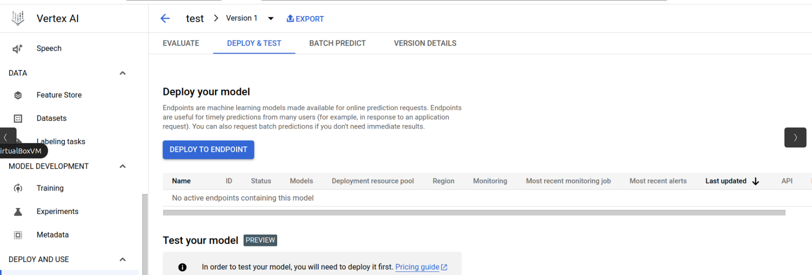

# Xgboost Model

The Xgboost Model project is a machine learning project that utilizes the Xgboost algorithm to create a predictive model. This model can be used for fraud detection or any other application that requires accurate predictions. The project provides step-by-step instructions for installation, usage, and contributing to the project.

## Usage Google Colab

To use a Colab notebook, you can follow these steps:

1. Open the Colab notebook: In the provided code excerpt, you can see a badge with the text "Open In Colab" and an associated link. Clicking on this badge will open the notebook in Google Colab.

2. Sign in to your Google account: If you are not already signed in to your Google account, you will be prompted to sign in before accessing the notebook. _(Make sure this google account have access to your gcp account)_

3. Run code cells: To run code cells in the notebook, you can simply click on the "Play" button next to the cell. Colab will execute the code and display the output below the cell. You can also modify the code in the cells and rerun them to see the updated results.

## Upload Model to Vertex endpoint

### First step: enable Vertex APIs

Before uploading the model to a Vertex endpoint, you need to enable the necessary APIs in your Google Cloud project. Follow these steps:

1. Open the Google Cloud Console: [https://console.cloud.google.com/](https://console.cloud.google.com/)

2. Select your project: If you have multiple projects, make sure to select the project where you want to enable the APIs.

3. Enable the required APIs: 
    - Look for vertex ai in the search bar
        
    - Once you are in the page click in **enable all recomended apis**
        
### Second step: import a model in the model registry

Once the APIs are enabled, you can import your model into the Vertex model registry. Follow these steps:

1. Scroll is left menu until you find **Model Registry**.
    

2. Open the "Model Registry" tab and click on "Import".

3. Provide a name and description for your model.
    

4. Select the model framwork and specify the location of your model file "model.bst" (Which you will have to have previously uploaded to a Google Cloud bucket.).
    
5. Click on "Import" to import the model into the model registry.

### Last step: deploy the model to an endpoint

After importing the model, you can deploy it to a Vertex endpoint. Follow these steps:

1. Open the model (in this example it is called "test") .
    

2. Click on "Deploy to endpoint" to deploy your model to a new endpoint.
    

3. Provide a name and description for the endpoint.
    
    
4. Configure the endpoint settings, such as machine type and number of instances.
    

5. Click on "Create" to deploy the model to the endpoint.

Once the model is deployed, you can use the endpoint to make predictions using your model.

